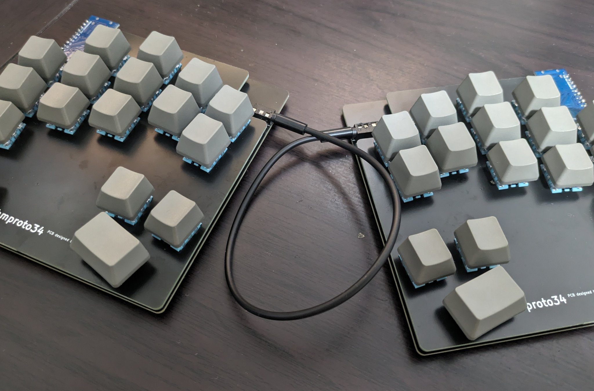
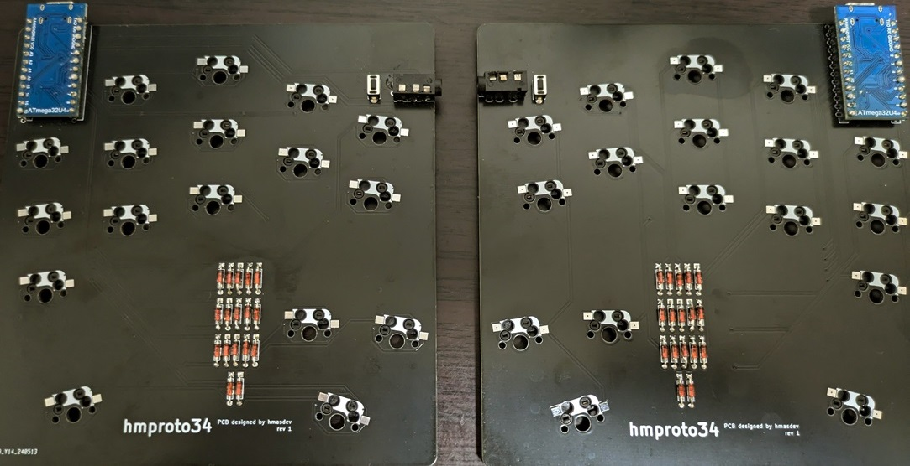
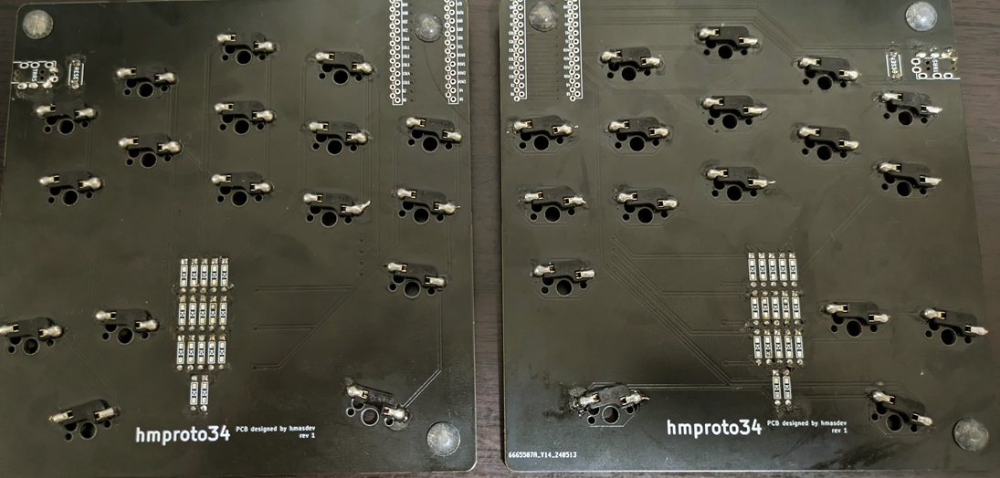
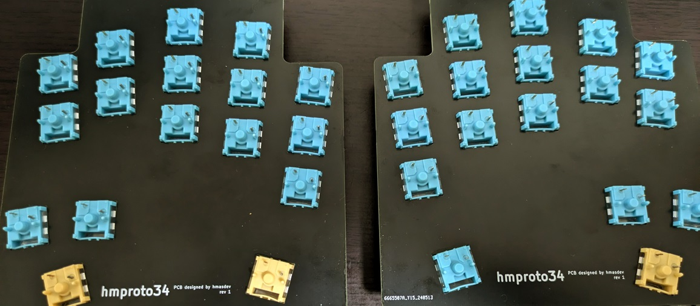

# hmproto34


hmproto34 is a hand-fitted keyboard with 34 keys.



## How to Use Firmware

The most simple way to use hmproto34 is to flash the pre-built firmware to your keyboard.

Download the latest firmware from [Releases](https://github.com/hmasdev/hmproto34/releases) and follow the instructions in [How to Flash Firmware](#how-to-flash-firmware).

The next 2 subsections explain how to build firmware and flash it to your keyboard.

If you want to know how to build the keyboard, see [How to Build Keyboard](#how-to-build-keyboard).

### How to Build Firmware

1. Setup your QMK environment
   - if you use Windows, install [QMK MSYS](https://msys.qmk.fm/)
   - See [https://docs.qmk.fm/#/newbs_getting_started?id=set-up-your-environment](https://docs.qmk.fm/#/newbs_getting_started?id=set-up-your-environment) for more information.
   - NOTE: assume that `qmk_firmware` directory is located at `~/qmk_firmware` in the following steps.

2. Open QMK MSYS
   - If you use Windows, open QMK from the start menu. See [https://msys.qmk.fm/guide.html#next-steps](https://msys.qmk.fm/guide.html#next-steps).

3. Clone this repository

   ```sh
   cd ~/qmk_firmware/keyboards
   git clone git@github.com:hmasdev/hmproto34.git
   ```

4. Build firmware

   ```sh
   qmk compile -kb hmproto34 -km default
   ```

Good! Now, you have a built firmware in `~/qmk_firmware/.build/hmproto34_default.hex`.

### How to Flash Firmware

1. Visit [Pro Micro Web Updater](https://sekigon-gonnoc.github.io/promicro-web-updater/index.html);
2. Select the firmware file (`~/qmk_firmware/.build/hmproto34_default.hex`);
3. Connect your left keyboard to your computer and press its reset button;
4. Click the `Flash` button on the website;
5. Wait for the flashing process to complete;
6. Repeat steps 3-5 for the right keyboard.

OK. Now, you can use your hmproto34 keyboard! Try typing something!

## How to Customize Keymap

1. After step 3. of [How to Build Firmware](#how-to-build-firmware), edit `~/qmk_firmware/keyboards/hmproto34/keymaps/default/keymap.c` to customize your keymap. If you want to add a new keymap, run `qmk new-keymap`;

2. Build firmware again;

   ```sh
   qmk compile -kb hmproto34 -km {default or your keymap name}
   ```

3. [Flash firmware again](#how-to-flash-firmware);

## How to Build Keyboard

### Required Components

| Component | Quantity | Note |
| --- | --- | --- |
| PCB | 2 | [Gerber files](./pcb) |
| Top Plate | 2 | [Gerber files](./top_plate) |
| Pro Micro | 2 | |
| TRRS Jack | 2 | |
| TRRS Cable | 1 | 3 or 4 poles |
| Tactile Switch | 2 | Reset Switch |
| Kalih PCB Socket | 34 | For MX Compatible Switch |
| MX Compatible Switch | 34 | |
| KeyCap | 30 (1u), 4 (1u-2u) | |
| Micro USB Cable | 1 | the type of USB depends on the Pro Micro |

### Assembly Steps

1. Solder PCB Sockets to the bottom of PCBs;
2. Attach diodes to the top of PCBs and solder them on the bottom of PCBs;
3. Attach tactile switches and TRRS jacks to the top of PCBs and solder them on the bottom of PCBs;
4. Attach Pro Micros to the top of PCBs;

   

   

5. Attach key switches to the top plate;

   

6. Joint the top plate and PCBs;
7. Build and flash firmware;
   - See [How to Build Firmware](#how-to-build-firmware) and [How to Flash Firmware](#how-to-flash-firmware) for more information.
8. Connect the left and right keyboards with a TRRS cable;
9. Enjoy typing!


## PCB and Top Plate

### PCB

Gerber files are located in [./pcb](./pcb) directory.
You can order PCBs from PCB manufacturers like JLCPCB etc.

### Top Plate

Gerber files are located in [./top_plate](./top_plate) directory.
You can order PCBs from PCB manufacturers like JLCPCB etc.

See [./top_plate/hmproto34-Edge_Cuts.svg](./top_plate/hmproto34-Edge_Cuts.svg) for the shape of the top plate.

## How to Contribute

1. Fork the repository: [https://github.com/hmasdev/hmproto34](https://github.com/hmasdev/hmproto34)
2. Clone the repository

   ```bash
   git clone https://github.com/{YOURE_NAME}/hmproto34.git
   cd hmproto34
   ```

3. Checkout your working branch

   ```bash
   git checkout -b your-working-branch
   ```

4. Make your changes

5. Commit your changes

   ```bash
   git add .
   git commit -m "Your commit message"
   ```

6. Push your changes

   ```bash
   git push origin your-working-branch
   ```

7. Create a pull request: [https://github.com/hmasdev/hmproto34/compare](https://github.com/hmasdev/hmproto34/compare)

## LICENSE

- [GPLv3](./LICENSE)

## Author

- [hmasdev](https://github.com/hmasdev)

## References

- QMK Firmware: [https://docs.qmk.fm/](https://docs.qmk.fm/#/)
- QMK MSYS: [https://msys.qmk.fm/](https://msys.qmk.fm/)
- kbd:[https://github.com/foostan/kbd](https://github.com/foostan/kbd), [https://github.com/7-rate/kbd](https://github.com/7-rate/kbd)
- Pro Micro Web Updater: [https://sekigon-gonnoc.github.io/promicro-web-updater/index.html](https://sekigon-gonnoc.github.io/promicro-web-updater/index.html)
- 自作キーボード設計入門: [https://pskbd.booth.pm/items/1044084](https://pskbd.booth.pm/items/1044084)
